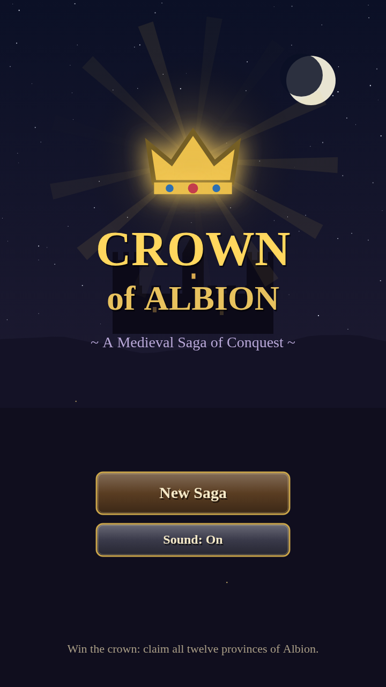
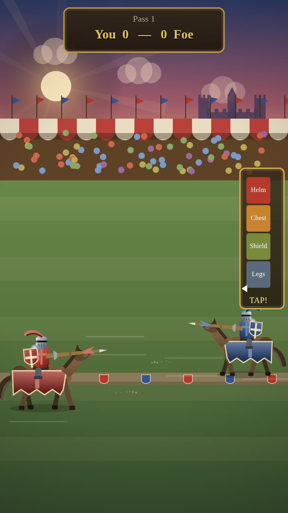

# Crown of Albion

*A medieval saga of conquest* — an original, mobile-first HTML5 strategy game in the
spirit of the classic 8/16-bit "conquer the realm" genre: rule a province, raise
armies, win tournaments, lay siege to castles, and claim the crown.

Everything in the game — the art, the names, the music — is original and generated
in code at runtime. There are no external assets, no build step, and no dependencies.



## How to play

Open `index.html` in any modern browser, or serve the folder:

```bash
cd games/crown-of-albion
python3 -m http.server 8080
# then visit http://localhost:8080 (works great on a phone on the same network)
```

The game is portrait-oriented and touch-first (mouse works too), with autosave —
close the tab and pick up where you left off via **Continue**.

## The goal

The king of Albion is dead. Twelve provinces of Britain — from Cornwall to the
Highlands — lie in dispute between you and three rival lords. **Claim all twelve
provinces to win the crown.** Lose all of your provinces and your house has fallen.

(The coastline is a simplified tracing of real geography; geography is public
domain, and every name on the map is a historical region of the island.)

## Each month you can

| Action | What it does |
|---|---|
| **Recruit** | Hire soldiers (8g), knights (25g, worth four soldiers), catapults (50g, needed to breach castle walls). |
| **March** | Tap a **land-bordering** enemy or neutral province and attack it. Choose bold, steady, or cautious tactics. |
| **Tournament** | Challenge a rival lord to the joust — wager gold, or (with enough fame) an entire province. |
| **Night Raid** | Sneak into a rival's keep and duel the guard captain for a share of his treasury. Get caught and you'll be ransomed. |
| **Seek Robin Hood** | Hold a province bordering Sherwood Forest, then visit the greenwood to win his archers at the contest of the bow. |
| **Fortify** | Reinforce a garrison or build a castle in any province you own. |

Marching, tournaments, raids, and seeking Robin Hood share one action per month;
recruiting and fortifying are always available.

### Borders matter
You can only march from a province you hold to one that **physically touches it on
land** — armies never cross open sea. Select any province to see its land borders
drawn out; the routes you can actually march along glow gold. (Adjacency is computed
from where provinces meet on the map, so an island province could only be reached if
it shared a land edge.)

### Sherwood Forest & Robin Hood
The green heart of the map is **Sherwood Forest** — the outlaws' domain. It can never
be conquered by any lord. Once you hold a province bordering the greenwood, visit
Sherwood and **Seek Robin Hood's Aid**: a three-arrow **archery contest** where a
reticle drifts across the target and you tap to loose. Score well and Robin's
**Merry Men longbowmen** join your host, his purse brings you gold lifted from the
richest rival lord, and your fame rises — then he and his men lie low for a few
months before they'll ride out again. Provinces pay taxes every month, and random
events — harvests, bandits, wandering knights, camp fever — keep the realm lively.

## The minigames

- **The Joust** — three passes against a rival lord. As you charge, tap to lock your
  lance on the swinging gauge: the helm scores best but is hardest to strike true.
  Unhorse him for 3 points; shatter your lance for 1.
- **The Siege** — drag back from your catapult, watch the trajectory preview, and
  release. Every wall segment you topple weakens the garrison before your assault
  goes in.
- **The Night Raid** — a torch-lit sword duel of reflexes: swipe the way the arrow
  points to cut, tap to parry, with an ever-shrinking timing window.



## Features

- A map of the real isle of Great Britain (hand-traced coastline, noise-roughened
  so it reads hand-drawn) divided into twelve historical provinces — Wessex,
  Mercia, Northumbria, York, Kent, East Anglia, Cornwall, Gwynedd, Cumbria,
  Lothian, Argyll, and the Highlands — plus the unconquerable **Sherwood Forest**,
  with bold inked province borders, embossed relief shading, terrain icons,
  coastal surf, drifting cloud shadows, sun-glint on the sea, a compass rose, a
  sea serpent, and an ornate chart border
- Strict land-border movement with on-map march routes, and a Robin Hood archery
  minigame reached by holding the lands around Sherwood Forest
- Lush, area-dependent terrain: every province is painted from its own biome
  palette — bright green meadows and patchwork fields on the lowlands, deep
  forest canopy, ochre-and-purple heather moors, and grey crags with snow on the
  high mountains — over directional sunlight, with ownership shown as a light
  heraldic glaze rather than a flat colour flood
- Battles fought on terrain that matches the province: snow-capped ranges and
  boulder fields in the mountains, rolling green downs and grass on the plains,
  silhouetted treelines in the forests, heather on the moors
- Cinematic presentation: slow-motion letterboxed joust impacts, god rays and
  golden-hour lighting, drifting birds and cloud shadows, layered hazy hills, a
  torch-lit night siege with flaming boulders and braziers, vignettes and
  atmospheric haze on every scene
- Hand-shaded characters: armored men-at-arms (mail, plate pauldrons, surcoats,
  heater shields, plumed bascinets), barded warhorses with flowing caparisons and
  crested great-helmed knights bearing couched lances with pennons, and Robin
  Hood as a hooded Lincoln-green outlaw with cloak, quiver and longbow — rendered
  with gradients, rim light and ambient shadow, and baked to cached sprites so the
  detail stays smooth on a phone
- A majestic, fully procedural medieval score: an 8-bar A-minor progression voiced
  with a round bass, sustained chord pads, a stately recorder-and-lute lead, and a
  war-drum, all through a generated hall reverb; fanfares and dirges share the same
  space
- Three playable champions with different strengths, and three difficulty levels
- Three rival AI lords who recruit, expand, besiege, and can be eliminated
- Fame system: renown from tourneys and conquest boosts your leadership in battle
  and unlocks province-stake wagers
- Procedural WebAudio soundtrack and effects (lute-style loop, fanfares, crashes),
  haptic feedback on supported phones, particles and screen shake throughout
- Autosave to `localStorage` after every significant action

## Development

No toolchain required. Two dev scripts (need Node; screenshots need Playwright):

```bash
node dev/smoke.js   # headless logic tests: map gen, battles, AI, save/load, scenes
node dev/shots.js   # drives the real game in headless Chromium and captures screenshots
```

Code layout:

- `js/core.js` — engine: canvas scaling, input (tap/swipe/drag), UI widgets,
  procedural audio, particles, toasts, modals
- `js/world.js` — map generation, game state, economy, battle resolution, AI, saves
- `js/scenes.js` — title, hero select, kingdom map, battle, joust, siege, raid, endings
